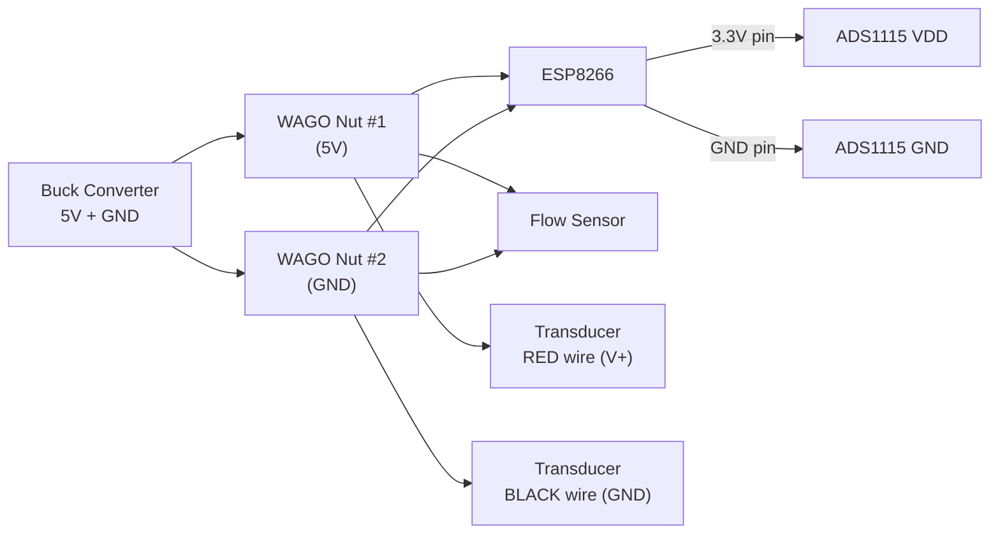
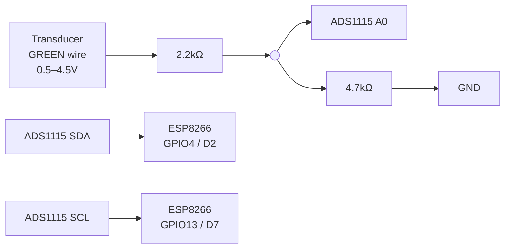
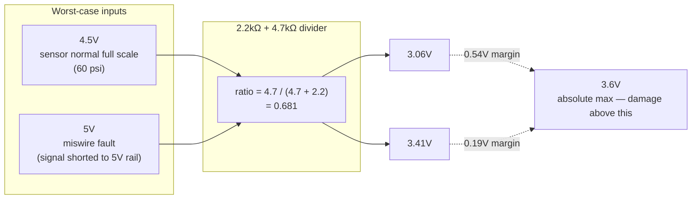

# Filter Pressure Transducer — Install Shortcard

**STATUS: DONE — installed, wired, flashed, and calibrated 2026-08-28.** This
card is now a record of what was actually built, not just a plan — kept
current through the whole install rather than written up after the fact.

**One real incident during install, worth remembering:** 12V was briefly fed
to the pressure sensor's red wire by mistake (instead of 5V), while it was
still connected to the ADS1115 through the signal divider. That's what
produced an impossible early reading of 82.1 PSI — not a wiring defect in
the divider, as first suspected. Both the sensor and the ADS1115 survived;
confirmed by re-bench-testing the sensor and getting a clean, sane two-point
calibration against the analog gauge afterward. **If a reading is ever
wildly out of physical range again, check the power source before assuming
the electronics are broken.**

Distilled from `docs/pool_data_addendum.md` Part 1 — read that for the *why*.
This is the *do* version, install-day only.

**Part ordered:** 0–60 psi, 1/8"-27 NPT male, 0.5–4.5V out, 5V supply. Scale
constant **15** (single-channel software formula — see section 3).

## Quick reference — every wire, one line each

Mechanical (threading the sensor into the filter) is covered separately in
section 1 below. This is only the electrical wiring — every single
connection, in build order. "Pressure sensor" = the transducer.

**What "same junction" means (steps 6 and 10):** a junction is just the
single physical point where three wires meet — not a part, just a joint.
You can build it two ways, both electrically identical: **"off the
point"** — twist/solder the two resistor legs plus a separate jumper wire
together somewhere convenient, and only that jumper's far end touches the
ADS1115 pin; or **"on the point"** — solder both resistor legs directly onto
the ADS1115 pin itself, no separate joint. **For a board with pre-soldered
male header pins (like the ShillehTek ADS1115), "off the point" is easier**
— build the joint away from the board, then finish it with a female Dupont
connector that pushes onto the male pin, rather than soldering more onto an
already-populated pin.

**ADS1115 ↔ ESP8266 (do these first)**
1. ESP8266 3.3V pin → ADS1115 VDD pin.
2. ESP8266 GPIO4 (labeled D2) → ADS1115 SDA pin.
3. ESP8266 GPIO13 (labeled D7) → ADS1115 SCL pin.
4. ESP8266 GND pin → ADS1115 GND pin.

**Signal divider — feeds ADS1115 pin A0**
5. Pressure sensor's GREEN wire → 2.2kΩ resistor, one leg.
6. 2.2kΩ resistor, other leg → ADS1115 A0 pin.
7. That same junction (step 6's ADS1115-side leg) → 4.7kΩ resistor, one leg.
8. That 4.7kΩ resistor, other leg → any ground point (WAGO GND nut or ESP8266 GND — same net either way).

**WAGO Nut #1 — 5V power**
9. Buck converter's 5V wire → WAGO Nut #1, port 1 (the "in" port).
10. WAGO Nut #1 → ESP8266's 5V/VIN pin.
11. WAGO Nut #1 → flow sensor's power wire.
12. WAGO Nut #1 → pressure sensor's RED wire.

**WAGO Nut #2 — ground**
13. Buck converter's GND wire → WAGO Nut #2, port 1 (the "in" port).
14. WAGO Nut #2 → ESP8266's GND pin.
15. WAGO Nut #2 → flow sensor's ground wire.
16. WAGO Nut #2 → pressure sensor's BLACK wire.

That's all 16 connections — nothing else gets wired. (ADS1115 GND is covered
by step 4, direct to the ESP8266 — it doesn't also need a wire to the WAGO
ground nut. Doesn't matter electrically which one you pick, since the
ADS1115 only draws ~0.2 mA, but no reason to run two wires to do one job.)

**No rail-compensation divider (A1) — evaluated and skipped, 2026-08-28.**
This would have watched the 5V rail itself on a second ADS1115 channel, so
software could cancel out small supply-voltage drift mathematically. Skipped
because the two-point calibration against the real gauge (section 4) already
corrects for any resulting offset/scale error, and it's one less divider to
build and one less thing that can go wrong. The software (section 3) uses
the single-channel formula that matches this — A0 only, no A1.

**Note on the signal divider's actual resistor values.** The spec called for
4.7kΩ + 10kΩ (ratio 0.680). What actually got built is **2.2kΩ + 4.7kΩ**,
which works out to almost the identical ratio — **0.681** — so it's
functionally equivalent for both protection and accuracy. No need to
rebuild it. The steps above already reflect the resistors actually used.

**No capacitors — evaluated and skipped, 2026-08-28.** They were originally
in the plan to smooth out a millisecond-scale voltage dip that happens when
the ESP8266's WiFi radio transmits, which can make the ratiometric sensor's
reading glitch for an instant. Dropped because: (1) the median filter
already in the software (step 3, section 3) discards a single bad sample
outright — it takes 3+ corrupted samples out of every 5 to even show up; (2)
the actual use for this data is a multi-day clogging trend, not
instant-by-instant precision, so a single-sample blip that isn't zeroed out
by the median wouldn't matter anyway; and (3) any backwash alert built on
this later should trigger on a sustained threshold crossing, not one sample,
same pattern as the booster interlock elsewhere in this project — which
absorbs the rest. The resistor dividers are unrelated and still required —
those protect the ADS1115's input pin from real voltage damage, not data
quality, so that reasoning doesn't apply to them.

## 0. Bench test first — before anything touches the filter

**Getting 5V is easier than it sounds — use a USB charger.** USB output is a
clean, regulated 5V, and the transducer only draws ~10 mA, so any phone
charger or laptop USB port handles it fine. Two no-solder ways to get wires
out of it:

- Buy a **"USB breakout board"** (~$3–5) — plugs into any USB port/charger,
  gives you labeled 5V and GND screw terminals or pins.
- Or cut up a spare **plain USB-A-to-USB-C or USB-A-to-micro-USB cable**
  (not Lightning — its internal wires aren't reliably color-coded and are
  thin enough to nick easily). Standard USB coloring on a plain cable is
  **red = 5V, black = GND** — strip those two, ignore the green/white data
  wires. Also use an older USB-A ("dumb cube") charger, not a newer USB-C
  one — USB-C chargers often output nothing until a proper digital
  handshake happens, which a bare cut wire can't do.
- Whichever cable you use, **confirm with the multimeter before trusting
  it** — same rule as everything else in this doc. Probe pairs of wires
  against each other on DC volts until you find the pair reading ~5V.

Plug into any charger, then: 5V (red) to the transducer's red wire, ground
(black) to its black wire, and probe the third wire in open air (not
connected to anything) with a multimeter set to DC volts, against black —
expect **~0.5V**. Confirms the unit is alive and IDs the signal wire (colour
is not reliable — undocumented for this range). ~2 min. Do this before
wiring or threading anything.

## 1. Hardware (mechanical)

1. **Pump OFF at the breaker.** Open the filter's air relief valve, bleed to
   0 psi. Confirm 0 on the analog gauge before touching anything — a tank at
   20 psi launches fittings.
2. Unscrew the stock gauge.
3. Thread in the **1/4" NPT brass street tee** — PTFE tape, 2–3 wraps, male
   threads only.
4. **Reinstall the stock analog gauge into one tee branch. Keep it.** It's
   the calibration reference in step 4 below, and it's what a pool tech
   looks at if the ESP is ever down.
5. Thread the **1/4"MNPT × 1/8"FNPT reducing bushing** into the other
   branch — PTFE tape. (Reducing *bushing*, not coupling — bushing is
   male-large/female-small, one piece.)
6. Thread the **transducer** into the bushing.
7. **Hand-tight + 1–2 turns wrench, no more.** The filter head is plastic —
   over-torquing brass cracks the boss (that's a tank replacement).
8. Before final tightening, **dry-check the stack clears the multiport
   handle's full rotation** and doesn't cantilever straight out. Orient the
   transducer down or sideways; strain-relieve the cable so it can't tug the
   fitting.
9. Re-open air relief, restart the pump, bleed air, check **both new
   joints** (tee→filter, bushing→tee — gauge and transducer joints too) for
   weeping.

## 2. Electrical

**What you're building, in plain terms:** the transducer's third wire
outputs a voltage between 0.5V (0 psi) and 4.5V (60 psi) — it's translating
pressure into "how many volts." The ESP8266 chip on the pad node can't read
a voltage precisely enough on its own, so you're adding a second small chip,
the **ADS1115**, which is good at reading voltages precisely and reports the
number to the ESP8266 over two wires (a communication method called
**I2C**). A pair of resistors, wired as a "voltage divider," sits between
the transducer and the ADS1115 — it just cuts the voltage down by a known,
fixed ratio so nothing exceeds what the ADS1115 can safely take in. Software
undoes that ratio with math in step 3, so the final number on the dashboard
is real PSI.

**Never a G1/8 part** — looks identical to 1/8" NPT, is a different,
incompatible thread standard, leaks or cracks the boss. Worth re-confirming
here since it's a mechanical detail with electrical consequences.

### Parts checklist

| Part | What it looks like |
|---|---|
| ADS1115 breakout board | Small board, roughly 1" square, with pins labeled VDD, GND, SCL, SDA, ADDR, ALRT, A0–A3 along one edge |
| Resistors: 2.2k ×1, 4.7k ×1 | Small cylinders with colored bands — buy them pre-labeled by value, don't try to read the color code by eye. (Original spec called for 4.7k + 10k — either pair works, see the note above the checklist.) |
| WAGO 221 lever nuts, 5-conductor, ×2 | Small clear plastic blocks with 5 flip-up levers on top, one wire port under each |
| Small perfboard, terminal strip, or just soldering directly | Something to physically join the resistors together — pick one option below |
| 22 AWG jumper wire | To connect the ADS1115 to the ESP8266's pins and to the resistor network |

*(No capacitors — considered and dropped, see the note above the checklist.)*

### Assembly — pick one way to join the resistors together

1. **Solder them straight onto the ADS1115 board's pins.** Most durable —
   worth it if you're comfortable with a soldering iron, since this box sees
   outdoor temperature swings.
2. **A small screw-terminal shield that plugs onto the ADS1115.** No
   soldering, a screw clamps each wire — good middle ground.
3. **Push wires into the ADS1115's pins with Dupont jumper connectors**,
   then put a dab of hot glue or silicone on each one so it can't vibrate
   loose. Easiest, least durable, but acceptable here — if this sensor ever
   fails, the symptom is just a stale pressure reading, not a safety issue.

The wiring steps below are the same no matter which you pick.

### Wiring, in order

**1. Build the pressure-signal divider** — this scales the transducer's
0.5–4.5V output down to something safe for the ADS1115 to read:

- Transducer's **signal wire** (the one you identified in the bench test,
  step 0) → one end of a **2.2k resistor**.
- Other end of that 2.2k resistor → **ADS1115 pin A0**.
- From that same junction point (where the 2.2k resistor meets A0), run a
  **4.7k resistor** down to **GND**.
- Picture a "Y": signal wire in, through the 2.2k resistor, then it splits —
  one leg continues to A0, the other leg goes through the 4.7k resistor to
  ground. (No rail-compensation divider on A1 — evaluated and skipped, see
  the note in the Quick reference section above.)

**2. Wire the ADS1115 board to the ESP8266** (the pad node's main board) —
four short wires:

| From ADS1115 pin | To ESP8266 pin |
|---|---|
| VDD | **3.3V** |
| GND | **GND** |
| SCL | **GPIO13**, labeled **D7** on the board |
| SDA | **GPIO4**, labeled **D2** on the board |

**3. Power everything through the WAGO lever nuts**, off the buck
converter's 5V output. If you haven't used one before: a WAGO 221 lever nut
is a small clear connector block with a flip-up lever over each port —
strip about 3/8" of insulation off the wire end, flip the lever up, push the
bare wire in until it stops, push the lever back down to clamp it. No
soldering, no tools, and you can undo it later by flipping the lever back
open.

- One 5-conductor WAGO nut on **5V**: buck converter's 5V wire goes into one
  port; three more wires come out the other ports, going to the ESP8266, the
  flow sensor, and the transducer's red wire. (**The ADS1115 does NOT go
  here** — its power comes from the ESP8266's 3.3V pin in step 4, not this
  5V rail. One port on this nut will be left empty — that's fine, it's why
  a 5-conductor size was bought instead of a 4-conductor.)
- A second 5-conductor WAGO nut on **GND**, wired the same pattern: buck
  converter ground in, three grounds out (ESP8266, flow sensor, transducer's
  black wire). The ADS1115's GND doesn't come here — it's a short direct
  wire to the ESP8266's own GND pin instead (step 4 above), since they're
  already sitting right next to each other. Doesn't matter electrically
  which ground point anything lands on — it's all one shared net — this is
  just the shorter wire run.

**4. Before powering anything on, look it over once.** No bare wire ends
touching each other, nothing bridging a V+ port to a GND port on the WAGO
nuts. Then power it up.

### Wiring diagram

Two views of the same circuit — power first, then the signal path.

**Power:**



**Signal path — how the transducer's reading gets to the ESP8266:**



(No A1 branch — the rail-compensation divider was evaluated and skipped;
this build uses A0 only.)

Each small circle is just a junction point — where three wires meet (the
resistor coming in, the resistor going down to GND, and the wire going
across to the ADS1115 input pin). It's not a component, just a solder joint
or a shared WAGO/terminal port.

**Why 2.2kΩ + 4.7kΩ specifically — the safety margin:**



Both worst-case inputs land under the 3.6V line after the divider — that
margin is why this pair is fine even though it's not the exact resistor
values originally specified (4.7kΩ + 10kΩ, ratio 0.680 — nearly identical).

## 3. Software (ESPHome)

**What's actually happening:** `esphome/pool-pad.yaml` is a plain text
configuration file. A tool called ESPHome reads it, turns it into a small
program ("firmware"), and sends that program wirelessly to the ESP8266 chip
you just wired up — that last part is what "flashing" means. You're adding
a few lines to the existing file, then running one command from your Mac.

**1. Open `esphome/pool-pad.yaml`** in this repo, in any text editor (VS
Code, TextEdit, whatever you normally use).

**2. Add a new `i2c:` block.** This tells the ESP8266 which two pins it's
using to talk to the ADS1115. Add it as its own section, lined up with the
other top-level sections already in the file (`esphome:`, `wifi:`,
`sensor:`, etc. — not indented inside any of them):

```yaml
i2c:
  sda: GPIO4      # D2
  scl: GPIO13     # D7
```

**3. Add two new entries to the `sensor:` list that's already in the
file.** The file already has a `sensor:` section — it holds the temperature
probes and the flow sensor. **Don't type a second `sensor:` line anywhere**;
that breaks the file, since YAML only allows one. Instead, scroll to the
existing `sensor:` section and add these two blocks as new items in that
same list — match the indentation of the entries already there, each one
starting with `- platform:`. (Single-channel version — A0 only, no A1 rail
sensor, since that divider was evaluated and skipped. See the note in the
Quick reference section.)

```yaml
  - platform: ads1115
    multiplexer: A0_GND
    gain: 4.096
    id: press_adc
    update_interval: 10s
    internal: true
    filters:
      - median: {window_size: 5, send_every: 5}

  - platform: template
    name: "Filter Pressure"
    id: filter_pressure
    unit_of_measurement: "PSI"
    accuracy_decimals: 1
    update_interval: 30s
    lambda: |-
      float a0 = id(press_adc).state;
      if (isnan(a0)) return NAN;
      float v = a0 / 0.681f;            // undo the input divider (2.2k/4.7k built)
      return (v - 0.5f) * 15.0f;        // 60 psi FS: FS / 4.0V
```

**4. Save the file, then flash from the Mac** — not the Pi. (This project's
rule: ESPHome devices are always flashed straight from the Mac, over WiFi,
never routed through the Pi.)

```bash
cd "/Users/mattdrazba/Code Repos/Jeeves/esphome" && uvx esphome run pool-pad.yaml
```

This compiles the firmware, connects to the pad node over WiFi by its name
(`pool-pad.local`), and uploads it. Terminal output will scroll for a
minute or two, then confirm the upload succeeded and the device
reconnecting. If it can't find the device, check that the pad node is
powered on and connected to the same WiFi network.

**5. Confirm it worked, in Home Assistant.** Look for a new entity called
**Filter Pressure**. Right after flashing — before the transducer sees real
pressure — a number near 0 is expected. If it shows `unknown` or `nan`
instead, that's telling you a wire isn't seated right; go back and check the
wiring in section 2 rather than the YAML.

## 4. Calibrate — same day, don't defer

1. Two points: pump off + air relief open = **0 psi**. Pump running at
   Program 4 (2200 RPM today) = whatever the **analog gauge** reads.
   Calibrate against the gauge, never the datasheet.
2. **This is also the range check.** If the computed value comes out at
   roughly **0.6× the gauge reading, a 100 psi unit shipped instead of 60** —
   change the `15.0f` constant to `25.0f` (that's `FS_psi / 4.0`, so 100÷4).
   The two sensors are physically identical and both give a plausible
   number, so nothing else catches this.
3. Fix small drift with a `calibrate_linear` filter on the template sensor —
   don't hand-edit the constant unless it's the range-check case above.
   **Done 2026-08-28** — two points: pump off (gauge 0 psi, raw digital read
   1.3) and pump on (gauge 7.9 psi, raw digital read 10.9). Digital was
   reading about 18% high plus a small offset — normal sensor-to-sensor
   variation, not a defect. Applied as
   `calibrate_linear: [1.3 -> 0.0, 10.9 -> 7.9]` on the `Filter Pressure`
   template sensor in `esphome/pool-pad.yaml`.
4. Once calibrated, **record the clean-filter baseline psi right after the
   next backwash.** Everything downstream (backwash-due alert at +8–10 psi
   over baseline) compares against this number. **Corrected 2026-08-29:
   anchor to measured `pump_watts` at the time of the reading, not to "2200
   RPM"** — the daily schedule actually runs three different speeds most
   nights (2000 RPM 9pm–12am, 1750 RPM 12am–4pm, 2200 RPM only during active
   heat-recovery diversion), so a baseline tied to one RPM label barely
   applies to routine data. `pool_heat_samples.pump_watts` is already logged
   per sample — use that for comparison instead.

## Don't

- Don't power the ADS1115 at 5V to avoid the divider — breaks I2C
  logic-level compatibility with the ESP8266's 3.3V side.
- Don't skip the bench test — it separates "dead sensor" from "wrong wire"
  from "bad ADC channel" before any of them tangle together on a wet pad.
- Don't leave Dupont jumpers un-secured in the chimney box.
- Don't touch the flow-meter multiply constant or the booster interlock
  logic — this sensor doesn't feed either. It's a new independent reading.
